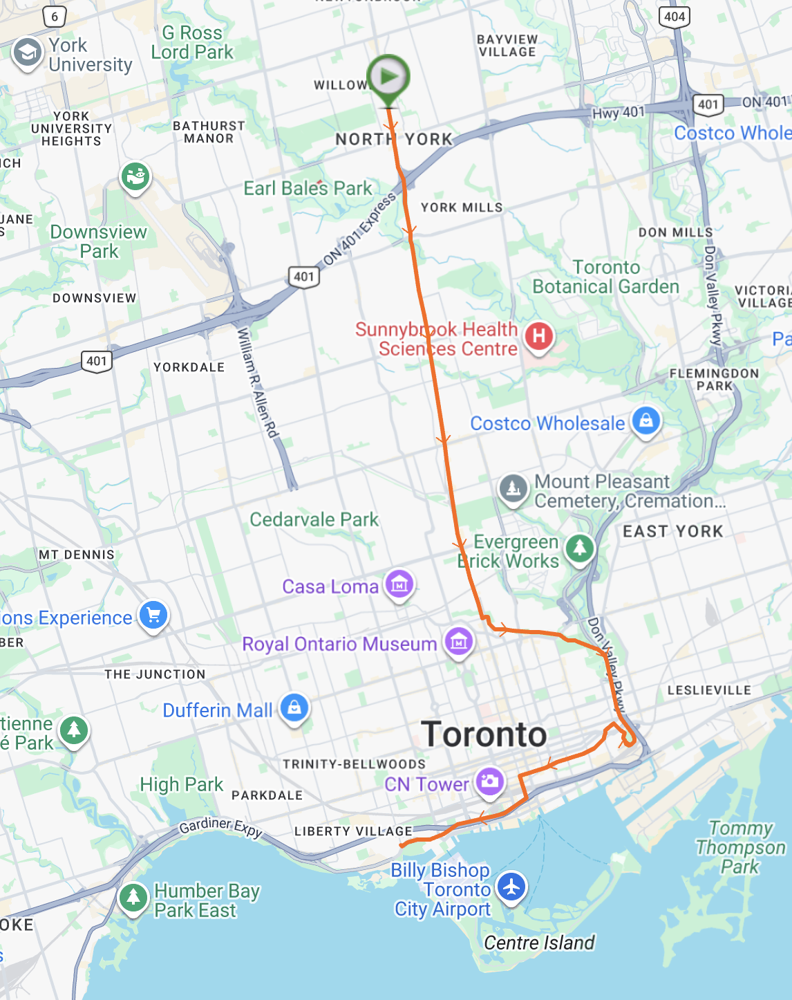

# running-telemetry-analytics

This repository contains the running telemetry analysis notebooks stored in [colab/](colab/). The analysis is based on data from the [Toronto Half Marathon](https://www.torontomarathon.com/races/half-marathon/).

Use [colab/README.md](colab/README.md) for the Colab links and notebooks analysis.
